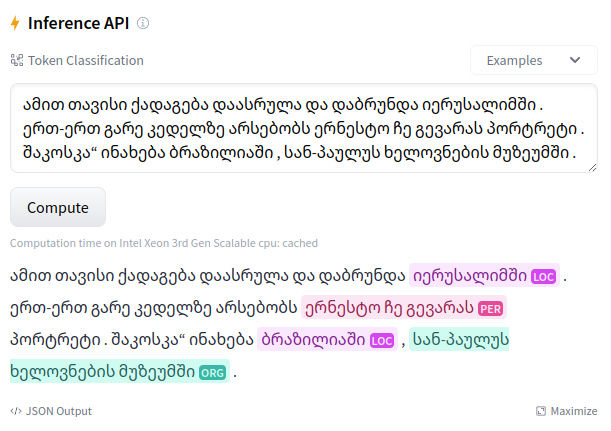

# 🇬🇪 Georgian NER

გამარჯობა! This repository contains my resources about Named Entity Recognition for Georgian.

# English-Georgian NER Model with Flair

We fine-tune a NER Model with Flair on English and Georgian training splits of WikiANN dataset
([Rahimi et al.](https://www.aclweb.org/anthology/P19-1015) splits).

Based on [this repository](https://github.com/stefan-it/autotrain-flair-mobie) the fine-tuning is done with the
awesome [Flair](https://github.com/flairNLP/flair) library, incl. support for Hugging Face's [AutoTrain](https://github.com/huggingface/autotrain-advanced).

We use a basic hyper-parameter search with the following configuration:

| Parameter     | Value             |
|---------------|-------------------|
| Learning Rate | `5e-06`           |
| Batch Size    | `4`               |
| Epoch         | `10`              |
| Seeds         | `[1, 2, 3, 4, 5]` |

We use [XLM-R Large](https://huggingface.co/xlm-roberta-large) as base model.

The following environment variables needs to be set when using AutoTrain:

| Environment Variable | Description                                                                                       |
|----------------------|---------------------------------------------------------------------------------------------------|
| `HF_TOKEN`           | Hugging Face User Access Token, which can be found [here](https://huggingface.co/settings/tokens) |
| `HUB_ORG_NAME`       | Username or organization under models will be uploaded to                                         |

The fine-tuning can then be started by running the `script.py` script.

## Model Card Creation

The [`ModelCardCreation.ipynb`](ModelCardCreation.ipynb) notebook shows how to automatically generate model cards for
all uploaded models. This includes also a results overview table with linked models.

## Fine-tuned Models

All fine-tuned models are released on the Hugging Face Hub, incl. a nice inference widget:

The fine-tuned models can be found [here](https://huggingface.co/models?search=autotrain-flair-georgian). Additionally,
they can be found in [this collection](https://huggingface.co/collections/stefan-it/georgian-ner-models-6556bd33dd1c096392074791).

# Changelog

* 17.11.2023: Add model card creation and fine-tuned models sections. Mention fine-tuned models on Hub.
* 15.11.2023: Initial version of this repository.
